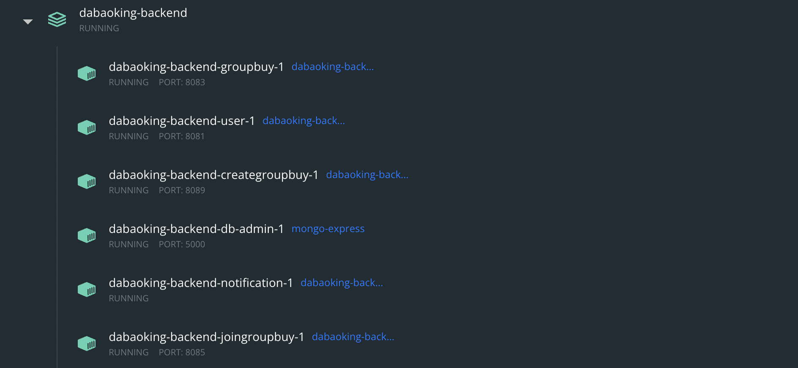

# DabaoKing

View the deployed UI at https://dabaoking-ui.vercel.app/

Backend deployed at https://kong-service-dabaoking-kong-seanjin97.cloud.okteto.net/

# How to start our application locally

## Start the backend.
1. `git clone https://github.com/seanjin97/dabaohero-backend`
2. `cd backend/dabaoking-backend`.
1. `docker compose up -d`.

## Build and run the frontend in production mode.
1. `git clone https://github.com/seanjin97/dabaohero-frontend`
2. `cd frontend/dabaoking-ui`.
2. Install [pnpm](https://pnpm.io/installation#using-corepack). We used the corepack method in the installation docs.
3. `pnpm i` to install dependencies.
4. `pnpm dev` to start the dev server.

## Verify if everything has started successfully
1. You should see this on Docker Desktop. Everything should be green. Please wait for up to 1 minute for `notification` to start, it depends on RabbitMQ to start before it starts. 
2. Go to the RabbitMQ console to verify that RabbitMQ is working. http://localhost:15672. 
`Username: root, Password: root`

3. Go to the MongoDB admin console to verify that MongoDB is working. http://localhost:5000. 
`Username: root, Password: root`

4. Go to any API microservice Swagger docs to test available apis. (Only applicable for FastAPI servers. [View a detailed breakdown of our backend](#microservices).)
    * URL: `localhost:<port>/<microservice_name>/swagger`
    * E.g. For `user` microservice's swagger docs go to http://localhost:8081/user/swagger. 

## ***Important notes
All steps in this sections is required to test all user scenarios on our app. You will have access to extremely limited features without setting up your payment details and payout account.

You will need 2 accounts to do this. One account will be the `buyer` (the person who searches and joins a groupbuy), the other account will be the `seller` (the person who creates a groupbuy and delivers the food).

1. Go to http://localhost:3000 on to 2 separate private browsers. 

2. Click on `Login` to create a new account or login.

3. Once successfully logged in you will see this. `Search an existing Groupbuy` or `Host a group buy` services are unavailable until you set up your stripe details. Head over to the `/Profile` page to set this up.

4. On your profile page, you should see that your `Payment details` and `Payout account` are not set up yet.

5. As a `buyer`, you will need to set up up your payment details. When prompted to key in card details. Please use the following test cards to test various user scenarios.
* Successful payment card: 
    * Card number: 4242424242424242
    * Expiration: 12/34
    * CVC: 123
* Invalid card: 
    * 4000000000000002
    * Expiration: 12/34
    * CVC: 123
* Card that is unable to pay: 
    * 4000000000000341
    * Expiration: 12/34
    * CVC: 123
 

6. As a `seller`, you will need to go through the `Payout account` flow to link your bank account to our app to receive payments. Please use test data as prompted by the UI. E.g. There is a button in this step which loads in a test phone number. Click on it to quickly populate through the UI.

7. When prompted for personal details. Click the `Retrieve Myinfo with SingPass` to quickly load test data in. This will direct you to the SingPass sandbox environment to mock a SingPass login. Select any user in the dropdown to proceed.

8. After the SingPass mock data is loaded in, please ensure that the `given name` and `surname` fields match the `Full name`.

9. In the next step, you will be prompted to link your bank account. Click on `Use test account` to use a test bank account.

10. Once complete you will be redirected to `/profile` page. You should see the following if you set up both payment details and payout account on the same account correctly.

11. Go to the `/home` page. You should be able to access `Search an existing Groupbuy` or `Host a group buy` depending on the steps above. If you set up both `buyer` and `seller` flows earlier on the same account, you should see this.

## Microservices
1. User - Atomic Microservice: API Server that manages user accounts and details. 
    * Name: user.
    * Port: 8081.
    * Language: Python.
    * Framework: FastAPI. 
    * All APIs to be prefixed with `/user`.
    * Swagger docs: http://localhost:8081/user/swagger
2. GroupBuy - Atomic Microservice: API Server that manages a groupbuy session. 
    * Name: groupbuy.
    * Port: 8083.
    * Language: Python.
    * Framework: FastAPI.
    * All APIs to be prefixed with `/groupbuy`.
    * Swagger docs: http://localhost:8083/groupbuy/swagger
3. Location - Atomic Service: API Server that handles geolocation logic. 
    * Name: location.
    * Port: 8082.
    * Language: Python.
    * Framework: FastAPI.
    * All APIs to be prefixed with `/location`.
    * Swagger docs: http://localhost:8082/location/swagger
4. Payment - Atomic Service: API Server that handles all payment logic. 
    * Name: payment.
    * Port: 8084.
    * Language: Python.
    * Framework: FastAPI.
    * All APIs to be prefixed with `/payment`.
    * Swagger docs: http://localhost:8084/payment/swagger
5. Notification - Atomic Service: Server that sends email notifications out to users.
    * Name: notification.
    * Not exposed over any port.
    * Language: Java.
    * Framework: Spring Boot
6. CreateGroupbuy - Complex Microservice: Server that handles a creating group buy . 
    * Name: creategroupbuy
    * Port: 8089.
    * Language: Python.
    * Framework: FastAPI.
    * All APIs to be prefixed with `/creategroupbuy`.
    * Swagger docs: http://localhost:8089/creategroupbuy/swagger
7. SearchGroupbuy - Complex Microservice: API Server that handles searching for an existing groupbuy session.
    * Name: searchgroupbuy
    * Port: 8091.
    * Language: Python.
    * Framework: Flask.
    * All APIs to be prefixed with `/searchgroupbuy`.
    * Swagger docs unavailable.
8. JoinGroupbuy - Complex Microservice: API Server that handles joining of an existing groupbuy session.
    * Name: joingroupbuy
    * Port: 8085.
    * Language: Python.
    * Framework: FastAPI.
    * All APIs to be prefixed with `/joingroupbuy`.
    * Swagger docs: http://localhost:8085/joingroupbuy/swagger
9. AcknowledgeDelivery - Complex Microservice: API Server that acknowledges success or failed delivery.
    * Name: joingroupbuy
    * Port: 8086.
    * Language: Python.
    * Framework: FastAPI.
    * All APIs to be prefixed with `/acknowledgedelivery`.
    * Swagger docs: http://localhost:8086/acknowledgedelivery/swagger.
10. RetrieveProfile - Complex Microservice: API Server retrieves all user specific data from `user`, `groupbuy` and `payment` to support displaying of information on the UI.
    * Name: retrieveprofile
    * Port: 8087.
    * Language: Python.
    * Framework: FastAPI.
    * All APIs to be prefixed with `/retrieveprofile`.
    * Swagger docs: http://localhost:8087/retrieveprofile/swagger.
